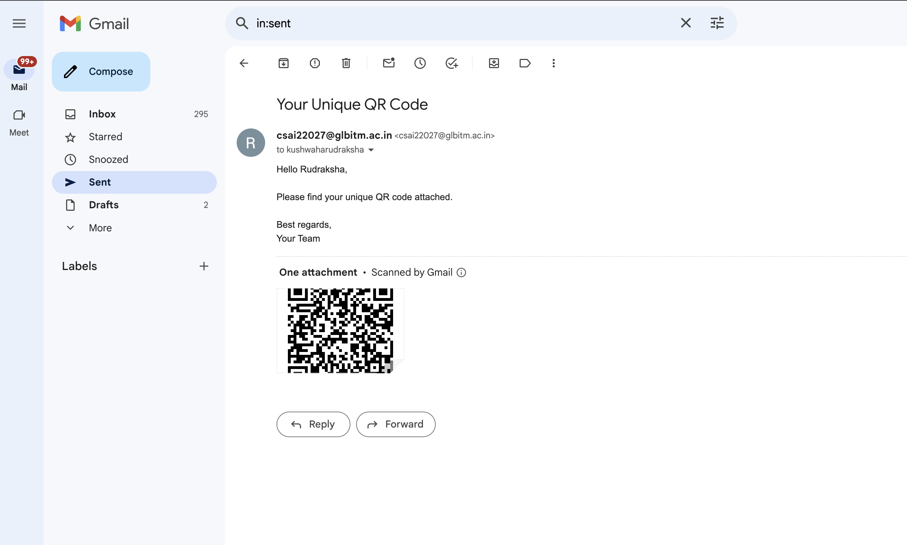

# UniQR Project 

## Overview

**UniQR** is a Python-based application that generates unique QR codes for attendees, enabling easy data storage and retrieval. It also allows for email distribution of these QR codes, streamlining the attendance process.

## Features

- **QR Code Generation:** Create unique QR codes based on participant details.
- **Email Functionality:** Send QR codes directly to participants via email.
- **Data Management:** Read participant details from a CSV file.
- **File Storage:** Save generated QR codes in a designated directory.

## Getting Started

### Prerequisites

Ensure you have the following installed on your machine:

- Python 3.x
- Pip (Python package manager)

### Installation

1. **Clone the Repository:**
   ```bash
   git clone <[repository_url](https://github.com/Rudra7009/QniQR)>
   cd UniQR
2. **Create a Virtual Environment (optional but recommended):**
   ```bash
   
   python -m venv myenv
   source myenv/bin/activate  # On macOS/Linux
   myenv\Scripts\activate     # On Windows
   
3. **Install Required Packages:**
   ```bash
   
   pip install pandas qrcode[pil] smtplib

### Configuration
Update the email configuration in main.py:

- Sender Email: Your email address
- Password: Your email password (consider using an app password for security)

### Running the Application
To deploy this project run

```bash
  python main.py
```
### Acknowledgments
- Pandas for data manipulation
- qrcode for QR code generation
- smtplib for email functionality

### CSV File Format

Prepare a CSV file named `attendees.csv` with the following format:
```bash
Email,Roll Number,Name
kushwaharudraksha@gmail.com,2201921520123,Rudraksha
csai22156@glbitm.ac.in,2201921520122,Rudraksha
```
## Screenshots



